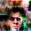

# MIC Project 1: Contribution to PyVision
### WGAN

This is a PyTorch 1.5.0 implementation of WGAN 

#### Requirements: 
1. Python 3.6+ 
2. Numpy 1.18.5
3. PyTorch 1.5+
4. Gdown 3.11.0
5. Matplotlib 3.2.1
6. CUDA - 10.1

#### Dataset
CelebA was used for the training of this model, which can be downloaded at [this httpURL](http://mmlab.ie.cuhk.edu.hk/projects/CelebA.html). 

1. If you wish to use your own dataset, the structure should be "datasets/sub_dir/img.png". The dataset will download as a file named img_align_celeba.zip. 

2. Once downloaded, create a directory named **celeba/** and extract the zip file into that directory.

3. The resulting directory structure should be: 
    ```
       /path/to/celeba
         -> img_align_celeba
             -> 188242.jpg
             -> 173822.jpg
             -> 284702.jpg
             -> 537394.jpg
    ```

This is an important step because we will be using the ImageFolder dataset class, which requires there to be subdirectories in the dataset’s root folder.
#### Usage

```python 
from model import GAN

# To train the GAN with default parameters
GAN(run_type="train") 

# To run inference using the GAN
GAN() 
```

#### Train
To train on your own dataset:

1. Specify dataset path in wgan.py " dataroot = 'path' " line 44.
2. You can change other parameters such as batch_size, etc but we suggest to use the ones already provided.
3. Please change the number of workers defined in wgan.py " workers = " line 49. 
4. More parameters regarding training length, learning rate, etc can be changed in train.py, starting line 178.
5. Number of epochs can be changed by altering the n_epoch in model.py, line 74.

## Inference
##### Weights from a pretrained model on CelebA will be downloaded automatically if not specified elsewise.
In order to run inference on your own trained model:
1. Change set_ckpt_dir in model.py
2. You can change the number of images generated by changing the "len" parameter in model.py, line 57

## Training details
* Number of epochs: 135
* Learning rate: 0.00001
* Clamp size: 0.01
* Batch size: 64
* Gpu Used: Nvidia 1660ti 6GB
* Training time: 9 Hrs


### Current output
