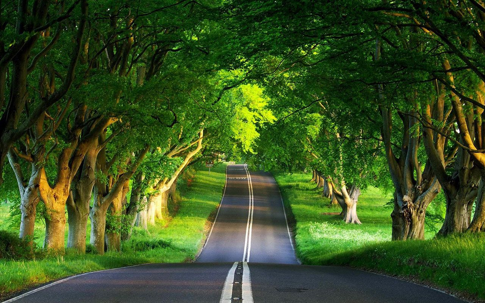
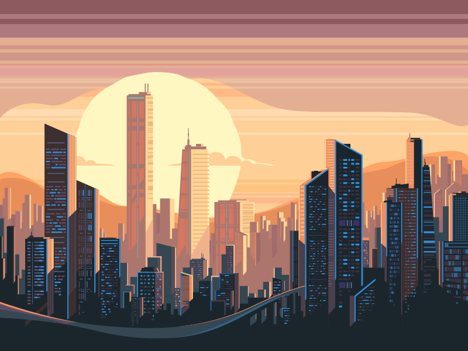
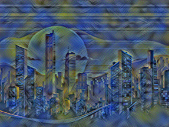
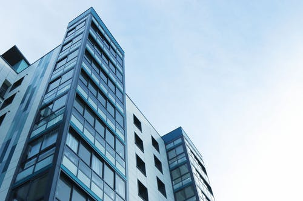
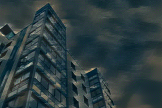

# Neural Style Transfer

An implementation of the paper _A Neural Algorithm of Artistic Style_
The paper can be read [here](https://arxiv.org/pdf/1508.06576.pdf).

The idea is to extract the _content_ from one image, the 'content image', and the _style_ or _texture_ from another image, the 'style image', to get a single output which has a combination of the two.

## A Few details about the implementation

- By default, for computation reasons, both style and content image are resized to 512x512 if using a GPU or 128x128 if on a CPU. If the *retain_dims* is set to True, the output is UPSAMPLED to original content image dimensions but this upsampling especially for 128x128 images reduces quality.

- This behavior can be disabled by setting the param *downsample* to False. This ensures that the style image is resized to the size of the content image and style transfer is run with original content image dimensions. **Note**: This would be computationally expensive so it is recommended to use GPU.

## Quick Start

- Using default settings, to run style transfer on a CPU or GPU

```
from pyvision.misc.NeuralStyleTransfer import NeuralStyle

style_img, content_img = (<path to style img or style img>, 'path to content img or content img')

nst = Neural_Style(save = "output.jpg")

output, time_taken = nst.run_style_transfer(style_img, content_img)
```

- To disable downsampling and run style transfer on original content image dimensions,

```
from pyvision.misc.NeuralStyleTransfer import NeuralStyle

style_img, content_img = (<path to style img or style img>, 'path to content img or content img')

nst = Neural_Style(save = "output.jpg", downsample=False, use_gpu=True)

output, time_taken = nst.run_style_transfer(style_img, content_img)
```

## Examples

For more examples, check [Examples](https://github.com/pranjaldatta/PyVision/tree/nst/pyvision/misc/NeuralStyleTransfer/Examples).

Content Image | Style Image | Result |
:-------------: | :---------: | :-----: |
| |  |
| |  |
| |  |

