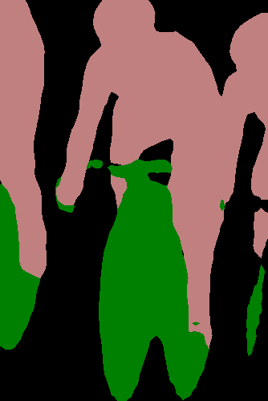
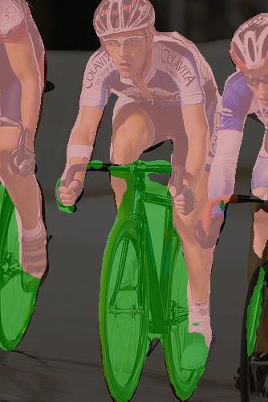
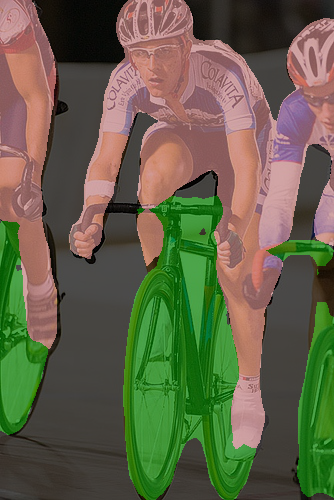

# Fully Convolutional Networks for Semantic Segmentation (FCN)

FCN uses a fully convolutional network to segment images into classes of objects. You can read the paper [here](https://arxiv.org/pdf/1605.06211v1.pdf). Check [summary](#Summary) for implementation details or [Usage](#Usage) for Usage details.

## Summary

The implementation makes use of the pretrained models made available by [PyTorch](https://github.com/pytorch). The models were trained on a subset of the COCO dataset containing only those classes that are present in the VOC2012 dataset.

| Model | Backbone | Dataset | Mean IoU/Global Pixelwise Accuracy|
|----|----|---|-----|
fcn-resnet-50 | resnet-50 | coco2017-train | 60.5 / 91.4 |
|fcn-resnet-101 | resnet-101 | coco2017-train | 63.7 / 91.9 |

## Usage

**Brief** 

The model setup is done via the FCN class exposed via *pyvision.segmentation.fcn*. All models and related config parameters can be configured from the class constructor.

Inference is run through the *inference()* method.

**Quick Start**

* To use the default *fcn-resnet50-coco* model,

```python

from pyvision.segmentation import fcn

fcn_model = fcn.FCN(device="cpu", show=False)

# item = path to an image or a cv2 image or a PIL Image
preds, seg_map, blend_map = fcn_model.inference(item, save="preds")

```

* To use the *fcn-resnet101-coco* model,

```python

from pyvision.segmentation import fcn

fcn_model = fcn.FCN(model="fcn-resnet101-coco", device="cpu", show=False)

# item = path to an image or a cv2 image or a PIL Image
preds, seg_map, blend_map = fcn_model.inference(item, save="preds")

```

* To list available models run,

```python

from pyvision.segmentation import fcn

print(fcn.available_models())

```

* To run tests, from repo root, run,

```shell

$ python tests/segmentation/fcn/fcn50.py
$ python tests/segmentation/fcn/fcn101.py

```

## Examples

**Dataset: COCO2017-train (VOC2012 classes)**

| Model | Original Image | Segmentation Map | Blend Image |
|---|-----|----|----|
|**fcn-resnet50-coco**||  | |
|**fcn-resnet50-coco**||  | |
|**fcn-resnet101-coco**||  | |
|**fcn-resnet101-coco**||  | |

## Contributed By

[Pranjal Datta](https://github.com/pranjaldatta)
