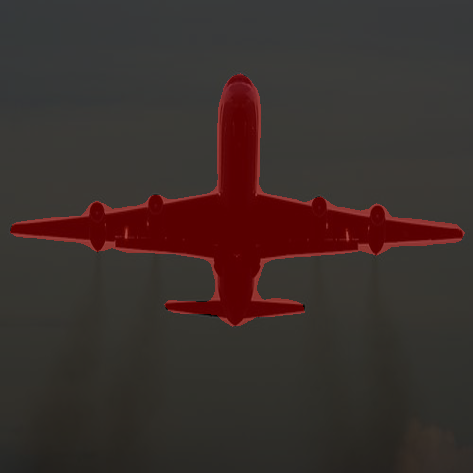
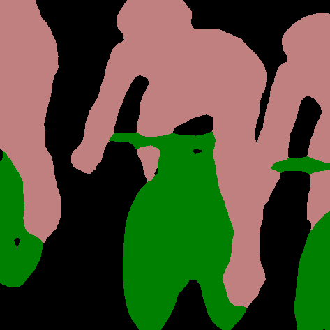
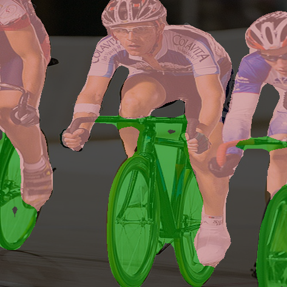
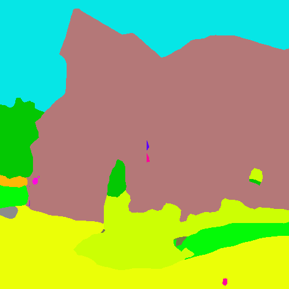
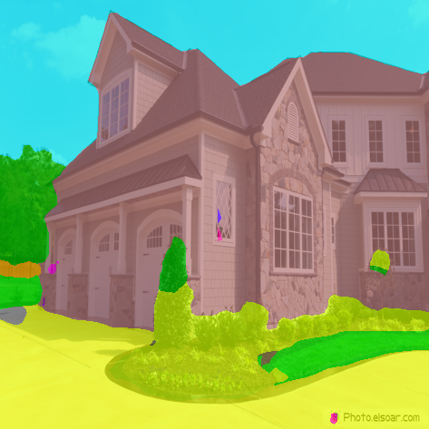
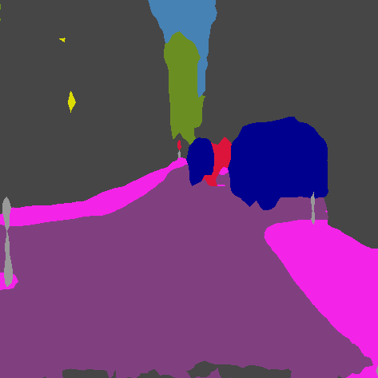
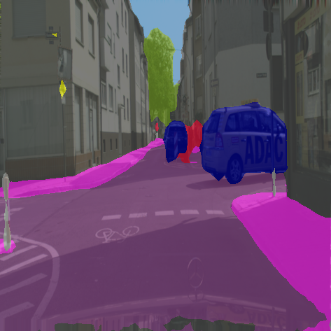

# Pyramid Scene Parsing Network (PSPNet)

PSPNet is an Image segmentation architecture that achieves high degrees of performance and accuracy on segmentation tasks. It uses a *Pyramid Pooling Module* to aggregate global image context information to make better predictions.

Read the paper [here](https://arxiv.org/pdf/1612.01105.pdf).
Check the [summary](#summary) for implementation details or [Usage](#Usage) for Usage details.

Check out this [notebook](https://github.com/pranjaldatta/PyVision/blob/master/demo/segmentation/pspnet/pspnet_demo.ipynb) to see how easily you can use PSPNet in 3-4 lines!

## Summary

This implementation makes use of pretrained models provided by the authors [here](https://github.com/hszhao/semseg). Currently, PyVision PSPNet supports the models listed below.

| Model | Backbone | Dataset | mIoU/mAcc/aAcc (Single Scale)| mIoU/mAcc/aAcc (Multi Scale) |
----|---|----|----|----|
| pspnet-resnet50-voc2012 | Resnet50 | VOC2012 | 0.7705/0.8513/0.9489 | 0.7802/0.8580/0.9513 |
| pspnet-resnet101-voc2012| Resnet101 | VOC2012 | 0.7907/0.8636/0.9534 | 0.7963/0.8677/0.9550  |
| pspnet-resnet50-ade20k | Resnet50 | ADE20k | 0.4189/0.5227/0.8039 | 0.4284/0.5266/0.8106 |
| pspnet-resnet50-cityscapes | Resnet50 | Cityscapes | 0.7730/0.8431/0.9597 | 0.7838/0.8486/0.9617|

### Note regarding Implementation

**downsampling**: The network as trained by the authors operate on Input images rescaled to 473x473. But when run without gpu, this configuration is computationally intensive. To resolve this situation, the implementation automatically downsamples the input image to a much smaller resolution of 225x225 **if** gpu is not available. On the other hand, **if** a gpu is available, this downsampling behavior is prevented. If explicitly needed, the user can overide this default behavior by passing a boolean (True or False) to the **downsample** parameter in the *PSPNet* constructor. (i.e. if downsample=True, downsampling behavior is enabled and vice versa)

## Usage

For more details, go through the docstrings/source code.

**Brief**

The model setup is done via the PSPNet class exposed via *pyvision.segmentation.pspnet*. All model related configuration parameters can be configured from the class constructor.

Inference is run through the *inference()* method.

**Quick Start**

- To use the default *pspnet-resnet50-voc2012* model,  

```python
from pyvision.segmentation import pspnet

# the model constructor
# setting device=gpu and downsample=False.
# Normally explicit setting of downsample=False
# isnt needed as it is automatically handled.
# This is just for demo purposes
m = pspnet.PSPNet(device="gpu", downsample=False)

preds, color_img, blend_img = m.inference("<path to img or img in PIL or array format", save="result")

```

- To use *pspnet-resnet50-ade20k* model,

```python
from pyvision.segmentation import pspnet

# the model constructor
m = pspnet.PSPNet(device="gpu", downsample=False)

preds, color_img, blend_img = m.inference("<path to img or img in PIL or array format", save="result")

```

- To list available models run,

```python
from pyvision.segmentation import pspnet

print(pspnet.models_available())
```

- To run tests, from repo root, run,

```shell
$ python tests/segmentation/pspnet/pspnet_test.py
```

## Examples

**Dataset: VOC2012**

|Original Image|Segmentation Map| Blend Image|
-----|-----|-----|
||| |
||| |

**Dataset: ADE20k**

|Original Image|Segmentation Map| Blend Image|
-----|-----|-----|
||| |

**Dataset: Cityscapes**

|Original Image|Segmentation Map| Blend Image|
-----|-----|-----|
||| |
